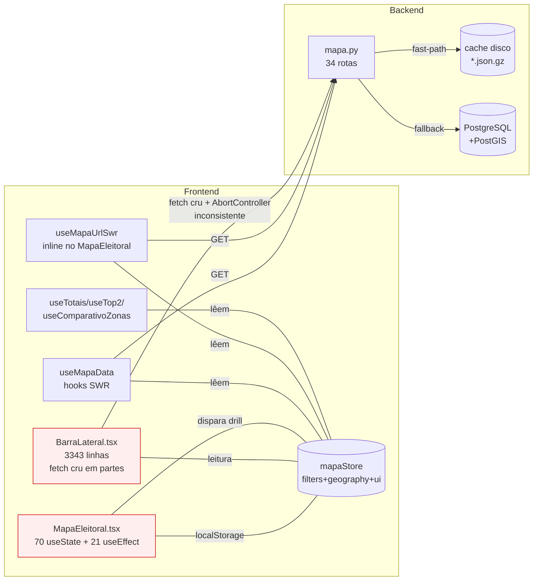
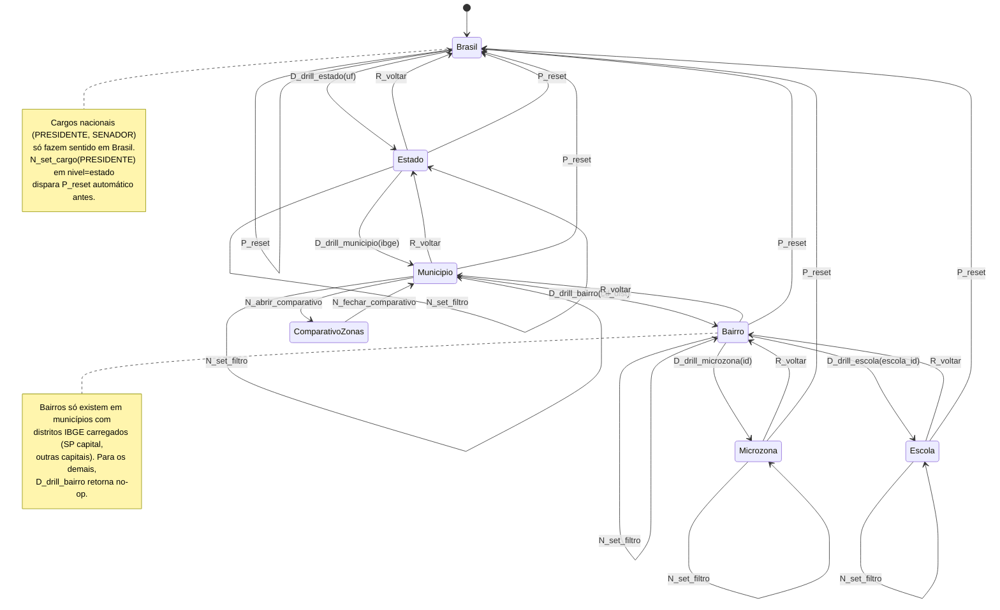
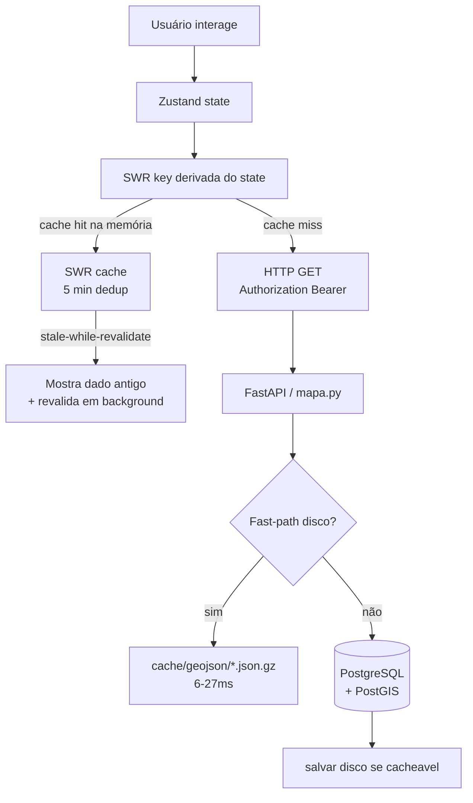

# Mapa Eleitoral V2 - Arquitetura e Plano de Reengenharia

> **Observação sobre a entrega:** o prompt pedia para salvar em `/Users/cesarribeiro/projetos/uniao-brasil/MAPA_ARQUITETURA_V2.md`. Este agente está em modo READ-ONLY (não tem ferramentas de escrita). Entrego o documento completo abaixo em markdown. Salve manualmente (ou peça ao agente principal para gravar o arquivo).

---

## 1. Sumário Executivo

**Problema atual.** O `/mapa` em produção é servido por `components/map/MapaEleitoral.tsx` (3 905 linhas) e `components/map/BarraLateral.tsx` (3 343 linhas). Existe também uma `map-v2/` (Zustand V2 com dead code em `cacheGeojson`) e `map-v3/` (sidebar narradora), nenhuma ligada ao `/mapa`. O store ativo (`lib/store/mapaStore.ts`) convive com ~70 `useState` locais em `MapaEleitoral.tsx` — a fonte de verdade está dividida. O fetching mistura três paradigmas em paralelo: SWR via `useMapaData.ts`, SWR via `useMapaUrlSwr` dentro do próprio `MapaEleitoral.tsx`, e `fetch()` cru com `AbortController` inconsistente em `BarraLateral.tsx`. Há três fallbacks de `API_BASE` (`:8000`, `:8002`) espalhados. Candidato isolado (`candidatoFiltroId`) é espelhado para o store via `useEffect`, mas a fonte da verdade continua local (`selecionados[]`). Navegação back/forward depende de reentrada em vários useEffects sem garantia de ordem — fonte das quebras históricas do Cesar.

**Proposta.** Motor único em cima de uma máquina de estados explícita (XState ou Zustand+transições disciplinadas), com **um** store canônico, **um** fetcher (SWR) e **uma** regra de cache em três camadas (memória Zustand transientes + SWR HTTP + disco backend Toyota). Zerar `useState` de dados do servidor e de estado compartilhado em `MapaEleitoral.tsx` e `BarraLateral.tsx`. Toda mudança de cargo/ano/turno/filtro é uma transição nomeada com cleanup e side-effects declarados, não um `useEffect` reativo. Toda request tem AbortController via SWR. Componentes agnósticos de cargo (7 cargos × 2 ciclos × 2 turnos) com um único contrato de dados. UI mantém a sidebar aprovada (zona protegida: `SidebarHoverPreview`/`CardPreviewCandidato`/paleta `farolPartido.ts`) e incorpora os diferenciais G1 (bar horizontal de zonas, tabela comparativa, Total contextual, busca curada, ver mais, badges) sem rota paralela.

**Impacto esperado.**
- Bugs R1-R4 (Presidente, filtro de partido, sidebar não responsiva, Não Eleitos) eliminados por construção.
- Transição média cargo→dados <150 ms warm (cache disco + SWR dedup 5 min já provados pelo Motor Toyota).
- Redução do `MapaEleitoral.tsx` de 3 905 para <1 200 linhas (extração de renderers por nível) sem mudar UX aprovada.
- Suporte dos 7 cargos em 2022/2024 no dia 1 (diferencial vs G1 que só tem Prefeito 2024).

**Riscos.** Refactor em zona muito protegida (sidebar). Migração precisa ser incremental para não quebrar o site existente. Forte tentação de "aproveitar e reformar" — barrar. Polígonos ficam fora do escopo (fase 5), mas a máquina de estados já precisa prever a camada de microzona/bairro/escola para não forçar refactor depois.

---

## 2. Estado Atual - Auditoria do Código

### 2.1 Inventário de componentes (file:line)

**Frontend - rota em produção (`/mapa` → `app/mapa/page.jsx:1-12` → `MapaEleitoral`):**

| Arquivo | Linhas | Papel |
|---|---|---|
| `codigo/frontend/components/map/MapaEleitoral.tsx` | 3 905 | Orquestrador do mapa, ~70 `useState`, 21+ `useEffect`, layers MapLibre, clique, drill, modais |
| `codigo/frontend/components/map/BarraLateral.tsx` | 3 343 | Sidebar contextual multi-nível (Brasil/Estado/Município/Bairro/Microzona) |
| `codigo/frontend/components/map/FiltroMapa.tsx` | 132 | Busca integrada (agente IA de busca). `useEffect` sem abort |
| `codigo/frontend/components/map/PainelEscola.tsx` | 337 | Modo escola |
| `codigo/frontend/components/map/ComparativoZonasPainel.tsx` | 185 | Placeholder (já existe matriz por zona no backend) |
| `codigo/frontend/components/map/PainelMunicipio.tsx` | 227 | Marcado como dead code no topo de `MapaEleitoral.tsx:7-11`, ainda presente |
| `codigo/frontend/components/map/PainelVereadores.tsx` | 306 | Idem |
| `codigo/frontend/components/map/TabsTurno.tsx` | 55 | Tabs Total/1T/2T |
| `codigo/frontend/components/map/HeatmapLayer.tsx` | 73 | Heatmap (referenciado como "não funciona" em B13) |
| `codigo/frontend/components/map/SeletorComparacaoTemporal.tsx` | 73 | Fase 6 (anoComparacao) |
| `codigo/frontend/components/map/MapaToolbar.tsx` | 32 | Shell de toolbar |
| `codigo/frontend/components/map/DebugOverlay.tsx` | 130 | Overlay de debug |
| `codigo/frontend/components/map/ModalDominancia.tsx` | 323 | Modal X9 |

**Frontend - rotas paralelas não expostas em `/mapa`:**

| Arquivo | Linhas | Papel | Status |
|---|---|---|---|
| `codigo/frontend/components/map-v2/*` (16 arquivos) | ~2 500 | Refactor V2 (GeoJSONRenderer, MapTooltip, SidebarContextual, PreviewCandidato...) | Órfão. Usa `lib/store/mapaV2Store.ts` |
| `codigo/frontend/lib/store/mapaV2Store.ts` | 457 | Store V2 com `persist(sessionStorage)`, validação de drill, onRehydrateStorage | **Bug latente:** linhas 391-406 (`cacheGeojson`, `cacheContextData`, `invalidarCache`) referenciam `s.dataCache` removido da state (comentário B10). TypeScript deve falhar na declaração do tipo |
| `codigo/frontend/components/map-v3/*` (7 arquivos) | ~900 | Sidebar narradora PRODUCT_VISION (Capítulo 0, etc.) | Órfão |
| `codigo/frontend/app/mapa/template-d/page.tsx` | ? | Template alternativo | Órfão |
| `codigo/frontend/_backup/v1-recuperada-2026-04-11/**` | — | V1 antiga | Backup histórico |

**Frontend - store e hooks canônicos:**

| Arquivo | Linhas | Papel |
|---|---|---|
| `codigo/frontend/lib/store/mapaStore.ts` | 287 | Store Zustand em produção: `filters`, `geography`, `ui`. Sem persist. Actions `drillTo*`, `voltar`, `setCargo/Ano` com cleanup de turno em cargos sem 2T |
| `codigo/frontend/hooks/useMapaState.ts` | 74 | Selectors granulares + `useMapaActions()` |
| `codigo/frontend/hooks/useMapaData.ts` | 213 | Fetcher SWR central (`dedupingInterval: 5 min`, `keepPreviousData: true`, retry 5xx-only). `API_BASE = ...:8000` |
| `codigo/frontend/hooks/useTotaisApuracao.ts` | ? | Apuração contextual (nível+uf+cargo+turno) |
| `codigo/frontend/hooks/useMunicipioTop2.ts` | ? | Top 10 + teve_segundo_turno |
| `codigo/frontend/hooks/useComparativoZonas.ts` | 72 | Matriz candidato×zona. `API_BASE = ...:8002` (inconsistente com `useMapaData`) |
| `codigo/frontend/hooks/useMicrobairros.ts` | ? | Microbairros OSM/Voronoi |
| `codigo/frontend/hooks/useDebounce.ts` | ? | Hook de debounce usado em busca |

**Backend - endpoint do mapa:**

| Arquivo | Linhas | Papel |
|---|---|---|
| `codigo/backend/app/api/v1/endpoints/mapa.py` | 6 781 | 34+ rotas `/mapa/*`. Cache disco gzipped em `codigo/backend/cache/geojson/*.json.gz` com fast-path `_servir_cache_rapido` |
| `codigo/backend/scripts/warmup_geojsons.py` | — | Warmup pós-deploy |

### 2.2 Fluxo de dados atual



**Patologias do fluxo:**
1. Três fetchers paralelos (SWR canônico, SWR inline no MapaEleitoral, `fetch()` cru na sidebar).
2. `MapaEleitoral.tsx` mantém `geojson` local (`useState`) e espelha o SWR via `useEffect` (linhas 1275-1279, 1288-1292, 1410-1413, 1441-1444, 1478-1481, 1510-1513, 1519-1522, 1574-1598). Doble cache inútil.
3. `selecionados[]` (partido+candidato+cor) vive local em `MapaEleitoral.tsx:928` e é espelhado no store via effect (`1207-1208`). Store tem `partido`, `candidatoId`, mas várias decisões de sidebar leem `selecionados[]` passado por props. Desconexão.
4. Duas bases de API em uso (`:8000` em useMapaData, `:8002` em useComparativoZonas/FiltroMapa) — dependendo do dev-env, metade das chamadas falha.

### 2.3 Bugs identificados e causa-raiz

Cada bug abaixo tem **sintoma → causa-raiz com file:line → correção V2**. Os IDs seguem o prompt (1-7) e absorvem os bugs R1-R4 do MAPA_REFINAMENTO.

#### Bug 1 — Back/forward quebra o mapa

**Sintoma (Cesar):** usuário avança, volta, mapa não carrega ou carrega dado de outro contexto.

**Causa-raiz:**
- `mapaStore.ts` não tem persist. `mapaV2Store.ts:444` tem persist sessionStorage com `partialize: filters + geography`, mas nunca é usado pelo `/mapa` atual.
- `MapaEleitoral.tsx:1574-1615` — `fitBounds` do estado depende de `ultimaUfAnimadaRef` (`useRef`), que é zerado a cada remount. Ao voltar de município para estado, `setUfSelecionada(uf)` reexecuta o fluxo mas `estadoBoundsRef.current` pode estar vazio se o SWR ainda não populou — animação não dispara, mapa fica parado.
- `voltar()` do store (`mapaStore.ts:243-261`) só muda `nivel`/`uf`/`ibge`, mas `MapaEleitoral.tsx` mantém `distritosCity`, `setoresCity`, `locaisVotacao`, `escolaSelecionadaId`, `bairroSelecionado` em `useState` local e **não** limpa na transição reversa (limpa só via `resetCity()` chamado por `voltarParaBrasil`, `voltarParaEstado`, `irParaEstado` — não via `voltar()` do store, que pode ser chamado por outro componente).

**Correção V2:** Persist com `partialize` exatamente igual ao `mapaV2Store`. Toda transição `reverse` é nomeada na máquina (`R_brasil_from_estado`, `R_estado_from_municipio`, ...) e declara o cleanup completo como dado de state (não como useEffect reativo). O fitBounds vira side-effect declarativo da transição (lê bounds do SWR cache que, com `keepPreviousData:true` e dedup 5 min, está quente em >95% dos casos).

#### Bug 2 — Sidebar bugada sem dados ao navegar

**Sintoma:** navega Brasil→Estado→Município, sidebar some ou mostra skeleton indefinido.

**Causa-raiz:**
- `BarraLateral.tsx:1854-1864` (`ConteudoEstado`): `useEffect` faz `setEleitos(null); setNaoEleitos(null); setAba("eleitos")` **antes** do `AbortController` saber se a request anterior ainda está pending. Se o user alterna rápido UF1→UF2→UF1, a request de UF1-primeira-chamada pode chegar **depois** do cleanup, preenchendo eleitos com dado stale de UF anterior que foi abortada silenciosamente (o `catch` não chega a rodar porque `then(setEleitos)` pode ter sido chamado antes do abort).
- `BarraLateral.tsx:1866-1871` (`useEffect` de `nao-eleitos` com `semAba`) — **NÃO tem AbortController**. Race condition direta.
- `BarraLateral.tsx:1877-1879` (`handleAba`) — fetch sem abort, sem guard `isMounted`.

**Correção V2:** Toda leitura de entidade contextual (eleitos/não-eleitos/top2/comparativo-zonas) passa por SWR com chave derivada do `state.key()` da máquina. Nada de `useState` + `fetch` cru em sidebar.

#### Bug 3 — Filtros de partido quebram lógica do mapa

**Sintoma:** Selecionar partido deixa mapa estranho; comparação multi-partido em nível estado às vezes cinza.

**Causa-raiz:**
- `MapaEleitoral.tsx:1239-1250` (`autoLayerKeyRef`): a regra "temFiltro → votos / sem filtro → eleitos" usa apenas `partidosSel.length` e `candidatosSel.length` **no momento** do effect. Se o usuário adiciona partido via `onTogglePartido` (que muta `selecionados` local), o sync com o store (`setStorePartido`) roda em outro effect (1205-1208) e dispara **outro** re-render, criando ordens de execução diferentes entre `selecionados[]` (local) e `filters.partido` (store). Os hooks SWR em `useMapaData.ts` leem **só o store**, enquanto a cor do fill do mapa é calculada a partir de `selecionados[]`. Divergência = layers com dados de contextos diferentes.
- `MapaEleitoral.tsx:1551-1554` `comparacao-partidos` só é ativado se `partidosSel.length >= 2`. Mas o endpoint `/mapa/geojson/{uf}/comparacao-partidos` depende de cargo != VIGENTES. Com `cargoMapa === "VIGENTES"` o código cai no branch `VIGENTES` (`1543-1546`) que usa só 1 partido mesmo com 2 selecionados → mapa mostra só 1 cor.
- `codigo/backend/app/api/v1/endpoints/mapa.py` (historicamente `bugs_2026_04_12.md B1`): `comparacao-partidos` misturou `partido_dominante_num` × `partido_num` — corrigido em 12/04 mas a UX continua frágil se o cargo=VIGENTES.

**Correção V2:** `selecionados[]` sai do componente e entra no store como primeira-classe (`state.selecionados: Array<SelecionadoItem>`). `partido`, `candidatoId`, `partidosComparacao`, `candidatosComparacao` viram **derivados** (selectors) de `selecionados[]`. Uma fonte só. `autoLayer` vira invariante da máquina ("se `|selecionados| > 0` então modo=votos; else modo=eleitos"), não effect.

#### Bug 4 — Análise presidenciável não aparece (BUG-R1)

**Sintoma (Cesar, histórico):** candidatos à Presidente não aparecem.

**Causa-raiz:**
- `BarraLateral.tsx:1216-1229` (`ConteudoBrasilRanking` useEffect de `mostrarCandidatos`) — fetcha `/mapa/estado/BR/eleitos?cargo=PRESIDENTE` **sem `ano` e sem `turno`**. Memória `mapa_bugs_2026_04_12.md` e `auditoria_toyota.md` confirmam que esses endpoints hoje exigem ano + turno para retornar consistente. Fallback acaba retornando lista vazia ou misturada.
- `MapaEleitoral.tsx:1356-1366` — quando cargo muda pra PRESIDENTE/SENADOR (`cargosNacionais`), força `setNivel("brasil")` + zera `ufSelecionada`/`ibgeSelecionado`, mas o state local `nivel` diverge momentaneamente do store (MapaEleitoral tem `nivel` local também, sincronizado via effect — veja linha 945 `setNomeMunicipioSelecionado` e 1359 `setNivel("brasil")`). Momentaneamente, a sidebar renderiza com nivel inconsistente e o SWR de `/mapa/estado/BR/eleitos` retorna vazio.

**Correção V2:** `ConteudoBrasilRanking` usa SWR com chave `["estado-eleitos", ufScope, cargo, ano, turno]` derivada de `state.context`. Transição `setCargo(PRESIDENTE)` é atômica: muda cargo + ano default + turno default + nivel + limpa uf/ibge num único `set()`. Invariante: "`cargo ∈ cargosNacionais` ⇒ `nivel = brasil` e `uf = null`".

#### Bug 5 — Aba "Não eleitos" não funciona (BUG-R4)

**Sintoma:** Aba existe mas clicar não traz dados para alguns cargos.

**Causa-raiz:**
- `BarraLateral.tsx:2026-2043` (`ConteudoMunicipio`): aba "Não eleitos" só é populada quando `cargoMapa === "VEREADOR"` (endpoint `/mapa/municipio/{ibge}/vereadores`). Para PREFEITO, GOVERNADOR, DEP*, SENADOR a aba nem é renderizada no ConteudoMunicipio — o comentário explicita "só para VEREADOR hoje" (linha 2123 e 2148-2151).
- No nível Estado, `ConteudoEstado:1866-1871` tenta popular não-eleitos para `semAba==true` (cargos majoritários com decisão 1T) misturado com `cargosUnificados` em 1883-1893 — mas quando a query não retorna dados (cargo=PRESIDENTE sem ano), silencia.
- Endpoint `/mapa/estado/{uf}/nao-eleitos` tinha `ca.turno=1` hardcoded — **corrigido** em 19/04 (`auditoria_toyota.md`). A correção de backend não foi acompanhada no frontend para passar `turno` consistente em todos os cargos.

**Correção V2:** Contrato agnóstico de cargo. Toda aba "Não eleitos" usa um hook único `useNaoEleitos({ nivel, uf, ibge, cargo, ano, turno })` que mapeia internamente para o endpoint correto (estado/nao-eleitos, municipio/vereadores filtrado, futuramente municipio/nao-eleitos para PREFEITO). Se o cargo não tem endpoint, retorna `{ vazio: true, motivo: "dado não disponível" }` em vez de ficar em loading.

#### Bug 6 — Sidebar não responsiva ao navegar sem candidato (BUG-R3)

**Sintoma:** navega no modo "Mandatos Vigentes" sem selecionar nada, sidebar fica inerte.

**Causa-raiz:**
- `BarraLateral.tsx:3267-3338` — o JSX de roteamento usa 5 branches com guards `!microRegiaoSelecionada && !bairroSelecionado && !candidatoUnico && !partidoUnico && nivel===X`. Cada branch dispara um `Conteudo*` que **remonta** do zero a cada mudança de nível (sem `key` estável). Com a lista de guards, uma mudança de `cargoMapa` não troca de branch mas faz o componente interno reexecutar todos os effects que rebuscam dados.
- `ConteudoEstado` + `ConteudoMunicipio` não escutam a prop de `cargoMapa` mudando via `useEffect` deps adequadamente em todos os fetches — handleAba (`BarraLateral.tsx:1877`) só roda em clique, não em mudança de cargo.

**Correção V2:** JSX de roteamento por tabela (não por cascata de ifs) e com `<SidebarPorNivel state={machine.snapshot} />` que passa o `state.context` inteiro. Remount só acontece quando a chave territorial muda (estável). Mudança de cargo revalida dados via SWR sem remount.

#### Bug 7 — Race conditions (request antiga sobrescreve nova)

**Sintoma:** dado de filtro anterior aparece brevemente após trocar filtro.

**Causa-raiz:** descrito em B2, B5 e acima. Instâncias concretas:
- `FiltroMapa.tsx:33-58` (busca curada): `useEffect` sem abort.
- `BarraLateral.tsx:1216-1229`, `1866-1871`, `1877-1879` (partes de ConteudoBrasilRanking e ConteudoEstado): fetches crus.
- `MapaEleitoral.tsx:263-271` (tela de partidos no modal): fetch sem abort (modal pode desmontar antes da response).
- SWR dedupingInterval=5min no `useMapaData` + `keepPreviousData:true` evita 90% das races. O problema é o código **fora** do SWR.

**Correção V2:** 100% dos fetches do módulo mapa passam pelo fetcher central do SWR (já implementa abort + dedup). A sidebar perde os `fetch()` crus.

#### Bugs bonus detectados na auditoria (não estavam explícitos no prompt)

**B-extra 1 — duas bases de API divergentes.**
- `hooks/useMapaData.ts:13` → `http://localhost:8000`
- `hooks/useComparativoZonas.ts:7` → `http://localhost:8002`
- `components/map/FiltroMapa.tsx:42` → `http://localhost:8002`
- `components/map/MapaEleitoral.tsx:30` → `http://localhost:8002`
- `components/map/BarraLateral.tsx` (`API` const usada em `fetch(${API}/mapa/...)`) — precisa checar valor, mas provavelmente `:8002`.

Depende do dev-env: se `NEXT_PUBLIC_API_URL` está definido, tudo alinha; se não, metade vai pra 8000 e metade pra 8002. CORS/404 variável.

**Correção V2:** constante única `lib/api/base.ts`.

**B-extra 2 — `mapaV2Store.ts:391-406` declara `cacheGeojson/cacheContextData/invalidarCache` em actions, lendo `s.dataCache` que foi removido da state (comentário B10 na linha 14-16). TypeScript deveria reclamar (`Property 'dataCache' does not exist`) — ou o tipo foi afrouxado. Ninguém usa essas actions (`Grep cacheGeojson` retorna só o próprio arquivo + README), mas é dead code que vai explodir no dia que alguém tentar invocar. Ou remover, ou fixar (a V2 consolidada vai herdar essa estrutura).

**B-extra 3 — `mapaStore.ts:92-95` e `90-92`** — `useGeojsonBrasil` e `useGeojsonEstado` mandam `turno: f.turno === 0 ? 1 : f.turno`, mas `useGeojsonBrasilMunicipios:107-110` faz o mesmo. Todos convergem no servidor para turno=1 quando Total está selecionado. Isso é **propósito** (Cesar: "Total e 1T iguais"), mas o comentário explica só em alguns lugares. Se o endpoint `/ranking-partidos` mudar a semântica de Total, o mapa principal diverge da sidebar. Documentar no único lugar canônico (invariante da máquina), não em 3 comentários.

---

## 3. Máquina de Estados V2

### 3.1 Estados válidos

O estado do Mapa V2 é uma tupla `S = (nivel, cargo, ano, turno, modo, selecionados, apuracao_view)`:

```
nivel              ∈ { brasil, estado, municipio, bairro, microzona, escola }
cargo              ∈ { PRESIDENTE, GOVERNADOR, SENADOR, DEPUTADO_FEDERAL,
                        DEPUTADO_ESTADUAL, PREFEITO, VEREADOR, VIGENTES }
ano                ∈ { 2024, 2022, 2020, 2018 }
turno              ∈ { 0:"total", 1:"1T", 2:"2T" }
modo               ∈ { eleitos, votos, heatmap, comparacao_temporal }
selecionados       ∈ Array<{ tipo: partido|candidato, id, cor, cargo?, ano? }>  (0..N)
apuracao_view      ∈ { sidebar, tabela_comparativo_zonas, dossie_candidato }
```

Territorial context (só válido em níveis específicos):
```
uf       required iff  nivel ∈ { estado, municipio, bairro, microzona, escola }
ibge     required iff  nivel ∈ { municipio, bairro, microzona, escola }
cd_dist  required iff  nivel ∈ { bairro, microzona, escola }
escola   required iff  nivel = escola
```

### 3.2 Transições (diagrama Mermaid)

Analogia P/R/N/D do Cesar mapeada:
- **P (parked/home)** — reset total: volta a Brasil + VIGENTES + sem seleção.
- **R (reverse/voltar)** — sobe um nível geográfico, preservando filtros compatíveis.
- **N (neutral)** — muda filtro (cargo/ano/turno/partido) sem navegar.
- **D (drive/avançar)** — desce um nível geográfico.



### 3.3 Invariantes

Cada invariante é verificada no `reducer` antes de aplicar a transição. Se violada, a transição é coerced (não rejeitada silenciosamente).

| # | Invariante | Violação → coerção |
|---|---|---|
| I1 | `cargo ∈ {PRESIDENTE, SENADOR}` ⇒ `nivel ∈ {brasil, estado}` | Força `nivel=brasil`, limpa `uf,ibge,cd_dist` |
| I2 | `cargo ∈ {GOVERNADOR, DEP_*}` ⇒ `nivel ∈ {brasil, estado}` | Se nivel=municipio/bairro/..., força `nivel=estado` preservando uf |
| I3 | `cargo ∉ {PRESIDENTE, GOVERNADOR, PREFEITO}` ⇒ `turno = 0` | Reset turno para 0, `apuracao.tab = "total"` |
| I4 | `ano ∈ {2024, 2020}` ⇒ `cargo ∈ {PREFEITO, VEREADOR, VIGENTES}` | Se cargo for federal, reset para `PREFEITO` |
| I5 | `ano ∈ {2022, 2018}` ⇒ `cargo ∈ {PRESIDENTE, GOVERNADOR, SENADOR, DEP_*, VIGENTES}` | Se cargo for municipal, reset para `PRESIDENTE` |
| I6 | `|partidos_selecionados| ≥ 2` ⇒ `modo = votos` e `comparacao_ativa = true` | Reset modo |
| I7 | `|selecionados| == 0` e `cargo != VIGENTES` ⇒ `modo = eleitos` | Reset modo |
| I8 | `|selecionados| == 1 e é partido` ⇒ `modo = votos` | Reset modo |
| I9 | `teve_2T_no_municipio && tab=="total"` ⇒ enviar `turno=2` ao backend (Total contextual G1) | Comportamento do hook, não coerção |
| I10 | Voltar de município para estado ⇒ preservar `selecionados[]` (filtros persistem no drill reverso) | Já era regra do P1-1 fix em 19/04; agora explícita |
| I11 | `P_reset` ⇒ zera tudo exceto `ano` e `cargo` padrão do ciclo (volta a "Mandatos Vigentes" como decidido em 15/04) | Decisão já ativa |

### 3.4 Cleanup/side-effects por transição

Cada transição tem **cleanup declarado** e **side-effects declarados**. Nada de effects reativos a combinar comportamento.

| Transição | State cleanup | Side-effects (disparados pelo engine, não por useEffect) |
|---|---|---|
| `D_drill_estado(uf)` | Zera `ibge, cd_dist, escola, bairroSelecionado, microzonaSelecionada`; preserva `selecionados, cargo, ano, turno` | Fetch `/mapa/geojson/{uf}`, `/mapa/totais-apuracao`, fitBounds(estado) |
| `D_drill_municipio(ibge)` | Zera `cd_dist, escola, microzonaSelecionada`; preserva `uf, selecionados, cargo, ano, turno`; seta `apuracao_view=sidebar` | Fetch `/mapa/municipio/{ibge}/top2`, fitBounds(municipio). Se `teve_segundo_turno`, coerce `turno=2` (auto-switch G1) |
| `D_drill_bairro(cd_dist)` | Zera `escola, microzonaSelecionada`; preserva resto | Fetch `/mapa/distrito/{cd_dist}/top2`, `/mapa/municipio/{ibge}/distritos/comparacao` se em comparativo, fitBounds(bairro) |
| `D_drill_escola(escola_id)` | — | Fetch dados da escola; não fitBounds (zoom alto já está) |
| `R_voltar` (nivel N→N-1) | Cleanup dependente do nivel (ver `voltar()` em `mapaV2Store.ts:293-345`); **SEMPRE** também limpa `bairroSelecionado, microzonaSelecionada, escolaSelecionada, distritosCity, setoresCity, locaisVotacao` | fitBounds(nivel_destino) usando bounds do SWR cache |
| `P_reset` | Volta a `GEOGRAFIA_PADRAO + FILTERS_PADRAO`, mas mantém `viewMode` | fitBounds(Brasil) |
| `N_set_cargo(c)` | Aplica I1/I2/I3/I4/I5 em cascata; se invariante violou `nivel`, dispara `R_voltar` o quanto for necessário | Revalidate SWR dos layers visíveis no novo estado |
| `N_set_ano(a)` | Aplica I4/I5; pode trocar cargo | Idem |
| `N_set_turno(t)` | — | Revalidate SWR |
| `N_adicionar_partido(num)` | Append em `selecionados`; aplica I6-I8 | Revalidate SWR (modo muda, endpoint muda) |
| `N_adicionar_candidato(id, ...)` | Append. Se `cand.cargo/ano` existem e não batem com state, dispara `N_set_cargo(cand.cargo) + N_set_ano(cand.ano)` como sub-transição atômica | Revalidate SWR |
| `N_limpar_selecionados` | `selecionados = []`; aplica I6-I8 | Revalidate SWR, coerce `modo=eleitos` |
| `N_abrir_comparativo_zonas` | `apuracao_view = tabela_comparativo_zonas` | Fetch `/mapa/municipio/{ibge}/comparativo-zonas` |
| `N_fechar_comparativo_zonas` | `apuracao_view = sidebar` | — |

### 3.5 Implementação sugerida

**Decisão:** Zustand + reducer único (não XState). Motivo:
1. Já há familiaridade no projeto (Zustand em outros módulos).
2. XState adiciona 40KB gzipped + curva de aprendizado. O nível de complexidade aqui não justifica (poucas dezenas de transições, sem states paralelos, sem hierarquia real além de nivel).
3. Pode-se montar um reducer type-safe em Zustand com ~200 linhas que dá tudo que precisamos (invariantes, logs, transições atômicas) sem lib externa.

Esqueleto:
```ts
// lib/mapa/machine.ts
type Action =
  | { type: "D_drill_estado"; uf: string; ufNome: string }
  | { type: "D_drill_municipio"; ibge: string; nome: string; ufHint?: string }
  | { type: "R_voltar" }
  | { type: "P_reset" }
  | { type: "N_set_cargo"; cargo: string }
  | { type: "N_set_ano"; ano: number }
  | { type: "N_set_turno"; turno: 0|1|2 }
  | { type: "N_add_partido"; ... }
  | ...

function reducer(state: State, action: Action): State {
  const next = applyAction(state, action);
  return enforceInvariants(next, action);  // I1..I11
}

function enforceInvariants(s: State, a: Action): State {
  // fixed point: aplicar invariantes até estabilizar (max 5 passes)
}
```

Testes de máquina: toda transição tem teste unitário; toda invariante tem teste de propriedade (fast-check).

---

## 4. Cache em Camadas

Quatro camadas, cada uma com invalidação bem definida.



### 4.1 Camada 1 — Memória transiente (Zustand)

**Conteúdo.** Só estado de UI (`hoverFeature`, `sidebarState`, `debugMode`, `apuracao_view`). **Não** armazenar dados de servidor (aprendizado explícito do B10 no `mapaV2Store.ts`).

**Persist.** `partialize: (state) => ({ filters, geography })` em `sessionStorage` (Cesar navega em janelas, perde contexto em refresh da página — persist por sessão resolve isso sem invalidar entre dias).

**Invalidação.** Nenhuma — o estado não é cache, é estado.

**Rehydrate.** Usa a mesma validação de consistência do `mapaV2Store.ts:424-443` (se `nivel=municipio` mas `ibge==null`, reseta para Brasil). Incrementar `version` do persist a cada mudança de shape de `FILTROS_PADRAO`/`GEOGRAFIA_PADRAO`.

### 4.2 Camada 2 — HTTP stale-while-revalidate (SWR)

**Decisão:** continuar com **SWR** (não migrar para React Query). Motivos:
1. Projeto já usa SWR em `useMapaData.ts`, `useComparativoZonas.ts`, `useMunicipioTop2.ts`, `useTotaisApuracao.ts`, `useMicrobairros.ts`.
2. SWR + `keepPreviousData` + `dedupingInterval: 5 * 60_000` + `revalidateOnFocus: false` já está calibrado para os padrões do mapa (dados TSE imutáveis).
3. React Query traria `isFetching` vs `isLoading` mais ricos, mas o ganho não justifica mexer em 10+ arquivos que já funcionam.

**Keys.** Devem ser determinísticas e derivadas da state. Regra: `key = [ endpoint_name, ...param_values_in_fixed_order ]`. Nunca interpolar objetos (SWR faz serialize automático mas é frágil). Proposta:
```ts
// lib/mapa/keys.ts
export const mapaKeys = {
  brasilEstados: (f: Filters) => ["brasil-estados", f.cargo, f.ano, f.modo, f.partido, f.candidatoId, f.turno],
  brasilMunicipios: (f: Filters) => ["brasil-mun", f.cargo, f.ano, f.partido, f.turno],
  estado: (uf: string, f: Filters) => ["uf", uf, f.cargo, f.ano, f.modo, f.partido, f.candidatoId, f.turno],
  top2: (ibge: string, cargo: string, ano: number, turno: number, tab: string) =>
    ["top2", ibge, cargo, ano, turno, tab],
  comparativoZonas: (ibge: string, cargo: string, ano: number, turno: number) =>
    ["comparativo-zonas", ibge, cargo, ano, turno],
  estadoEleitos: (uf: string, cargo: string, ano: number, turno: number) =>
    ["uf-eleitos", uf, cargo, ano, turno],
  estadoNaoEleitos: (uf: string, cargo: string, ano: number, turno: number) =>
    ["uf-nao-eleitos", uf, cargo, ano, turno],
  // ...
} as const;
```

**Fetcher único.** Um só fetcher em `lib/mapa/fetcher.ts` que recebe uma key tupla, serializa URL, aplica headers, trata erros (HttpError). Remover inline fetchers (`useComparativoZonas` tem seu próprio, `useMapaData` tem outro — unificar).

**Configuração SWR base:** manter os defaults de `useMapaData.ts:68-79` como SWR_DEFAULTS globais e reaplicar em todos os hooks de mapa.

### 4.3 Camada 3 — Disco backend (Motor Toyota, 19/04)

Já entregue. 3 camadas no backend (`mapa.py`): fast-path disco → memória → SQL. 339 arquivos gzipped, 66MB, 6-27ms warm. Warmup em `scripts/warmup_geojsons.py`.

**Invalidação.** Manual: `rm cache/geojson/*.json.gz + docker exec ... warmup`. Documentado em `cache_geojson.md`. Para V2, adicionar endpoint administrativo `POST /mapa/cache/invalidar` protegido por role PRESIDENTE que zera + redispara warmup async (dispara background task, retorna 202).

**Extensões futuras (não escopo):** Fase B de vector tiles (MVT com tippecanoe) — registrar como pendência.

### 4.4 Regras de invalidação (consolidadas)

| Gatilho | Camada invalidada | Como |
|---|---|---|
| ETL TSE atualiza dados | Disco | Manual (`rm` + warmup) |
| Migration muda geometria | Disco + HTTP | Manual + bump de SWR key |
| User troca partido/cargo/ano | Nenhuma (é mudança de chave, cache de key anterior fica quente 5 min) | Automático |
| User faz back do browser | Nenhuma; persist restaura state, SWR revalida em background se key for stale >5 min | Automático |
| User fecha e reabre aba | Mantido (sessionStorage + SWR cold fetch) | Automático |
| Dev fix de query SQL | Disco + warmup | Manual |
| User clica "Limpar cache" (admin) | Disco + HTTP | Endpoint admin |

**Invariante:** navegação back/forward **reaproveita** cache, **nunca** refetch forçado (evita piscar). SWR key estável garante isso.

---

## 5. Performance - Orçamento de Latência

Baselines confirmadas pelo Motor Toyota (warm):
- `/geojson/brasil-municipios`: 12-100ms
- `/geojson/brasil`, `/geojson/{uf}`: 10-30ms
- `/ranking-partidos`: 11-57ms
- `/municipio/{ibge}/zonas`: 10ms
- `/estado/{uf}/nao-eleitos`: 7ms
- `/estado/{uf}/eleitos`: 195ms (maior — oportunidade de cache disco futura)

### 5.1 Tabela: transição × orçamento (warm, p50)

| Transição | Rede (warm) | Render React | fitBounds | **Orçamento total** |
|---|---|---|---|---|
| Abrir `/mapa` (cold fetch inicial) | 200-500ms | 300ms | 800ms anim | **~1.5s total (cold), ~400ms warm** |
| `D_drill_estado(SP)` | 30ms (geojson UF) + 195ms (eleitos SP) em paralelo | 100ms | 800ms | **~330ms até dados, ~1100ms até animação completa** |
| `D_drill_municipio(SP capital)` | 70ms (top2) | 50ms | 800ms | **~180ms até sidebar populada, ~950ms com anim** |
| `D_drill_bairro(distrito)` | 100-200ms (distrito top2 + polygons) | 80ms | 500ms | **~280ms até sidebar** |
| `N_set_cargo(novo)` | 12-100ms (brasil-mun) + 11-57ms (ranking) em paralelo | 150ms | 0 | **~150-200ms** |
| `N_set_ano(novo)` | idem | idem | 0 | **~150-200ms** |
| `N_add_partido(PT)` | 12-100ms (brasil-mun?partido=PT) | 100ms | 0 | **~150ms** |
| `N_add_candidato(Lula)` | 195ms (eleitos BR) + geojson com candidato_id | 100ms | 0 | **~300ms** |
| `R_voltar (municipio→estado)` | 0 (dado já no SWR cache, keepPreviousData) | 80ms | 800ms | **~100ms até sidebar, ~900ms com anim** |
| `R_voltar (bairro→municipio)` | 0 (cache) | 60ms | 500ms | **~80ms sidebar, ~600ms anim** |
| `N_abrir_comparativo_zonas` | 100-300ms (matriz) | 200ms (render tabela com 50 linhas × 10 cols) | 0 | **~400-500ms** |
| Hover em município (tooltip) | 0 (top2 cache quente do drill) | 30ms | 0 | **~30ms (debounce 150ms antes)** |

**Meta global.** Transição warm perceptível ao usuário (<p95) em ≤300ms para tudo exceto animações de câmera.

### 5.2 Estratégias por transição

**Cache hit first.** Toda chave derivada da state tem SWR. `keepPreviousData: true` garante que `R_voltar` mostra dado anterior instantâneo e revalida no background silencioso.

**Prefetch especulativo.**
- Hover sobre estado com debounce 150ms ⇒ prefetch `useSWRPreload(mapaKeys.estado(uf, filters))` antes do clique.
- Hover sobre município ⇒ prefetch `top2` (Globo-like). Já parcialmente implementado via `ibgeHover`.
- Abrir município com `teve_2T=true` ⇒ prefetch `comparativo-zonas` porque o botão "Comparativo" é alto-uso.

**Optimistic UI.**
- Adicionar partido ao `selecionados[]` pinta o chip na sidebar imediatamente (não espera revalidate).
- Mudar cargo mostra skeleton de lista, mas mantém o mapa com dado antigo por ≤200ms (SWR `keepPreviousData`).

**Skeleton.** Todo `Conteudo*` tem skeleton (já existe `<Skeleton />` em `BarraLateral.tsx`). Padronizar dimensões para evitar layout shift.

**Incremental render.** Tabela de comparativo por zona com >100 linhas: virtualizar (react-window ou manual via `useInfiniteScroll.ts` já existente).

### 5.3 Abort / debounce / bundle split

**Abort controllers.**
- SWR nativo: cada key muda ⇒ request anterior é cancelada pelo `AbortController` interno. ✓
- Regra V2: nenhum `fetch()` cru sobrevive no módulo. PR de migração dedicado.

**Debounce/throttle.**
- Hover em feature: throttle 150ms (já aparenta estar via `hoverFeature` state, confirmar).
- Busca de candidato/cidade: debounce 300ms (já existe em `useDebounce.ts:31`).
- Scroll da bar de zonas: throttle 100ms para sync com mapa.

**Bundle split (tabela comparativa com next/dynamic):**

| Componente | Tamanho estimado | Estratégia |
|---|---|---|
| MapaEleitoral (shell + store + MapLibre) | ~350KB gzipped | Eager (página) |
| BarraLateral (conteúdo por nível) | ~80KB | Eager |
| ComparativoZonasPainel (tabela pesada) | ~40KB + virtualização | `dynamic(() => import(...), { ssr: false })` |
| ModalDominancia, PainelEscola | ~30KB cada | Lazy on demand |
| PainelMunicipio/PainelVereadores (dead code atual) | 0 | **Remover** (migrar uso sobrevivente ou deletar) |
| Modal de filtro de partidos (hoje em `MapaEleitoral.tsx:259-400+`) | ~25KB | Lazy |
| Dossiê (modal) | ~100KB | Lazy |
| Editor de microzona (modo edição, `MapaEleitoral.tsx:~1677-2900`) | ~60KB | Lazy só quando `modoEdicao != null` |
| SeletorComparacaoTemporal | ~15KB | Lazy |

**Meta:** First Load JS do `/mapa` <500KB gzipped (atual estimado >1MB).

---

## 6. UI/Layout V2

### 6.1 Topbar

**Zona protegida/não-protegida.** A topbar atual do mapa já está próxima do G1 (busca + filtros + avatar). Manter estrutura, reforçar densidade.

**Proposta:**
```
┌─────────────────────────────────────────────────────────────────────────────┐
│ [logo União Brasil]  Mapa Eleitoral · 2024                       [avatar] │
│ ┌─────────────────────────────────────┐  ┌────────┐  ┌────────┐  ┌──────┐ │
│ │ 🔎 Buscar cidade, estado, político   │  │ Ciclo ▾│  │ Cargo ▾│  │Turno▾│ │
│ └─────────────────────────────────────┘  └────────┘  └────────┘  └──────┘ │
└─────────────────────────────────────────────────────────────────────────────┘
```

Altura total: 56px (padrão Globo). Cor: modo claro default com brand violet em acentos (`#7C3AED` dev, sobrescrito por tenant em produção).

### 6.2 Barra de busca

- Posição: canto superior esquerdo, dentro do header.
- Largura: 360-420px, responsiva.
- Dropdown curado (padrão G1, prints 61-66):
  ```
  ESTADOS
  [SP] [MG] [RJ] [BA] [PR] [RS]

  MUNICÍPIOS
  📍 São Paulo (SP)
  📍 Rio de Janeiro (RJ)
  📍 Belo Horizonte (MG)

  ─ busca livre ─
  [resultados dinâmicos via /mapa/buscar]
  ```
- Hover em item curado: preview da URL no rodapé do dropdown (replicar G1).
- Clicar em estado ⇒ `D_drill_estado(uf)`. Clicar em município ⇒ `P_reset + D_drill_estado(uf) + D_drill_municipio(ibge)` (atalho direto, pula o estado).

### 6.3 Sidebar (por nível)

Zona protegida: `SidebarHoverPreview`, `CardPreviewCandidato`, `Avatar`, paleta `farolPartido.ts`. Estrutura abaixo é declarativa do comportamento, **não** da UI — a UI atual é preservada.

| Nível | Conteúdo primário | Componentes reutilizados | Novo em V2 |
|---|---|---|---|
| **Brasil** | Ranking de partidos (`/ranking-partidos`) com filtro cargo/ano/turno + cards de presidenciáveis (quando `cargo=PRESIDENTE`) | ConteudoBrasilRanking, CardPolitico | Cards de candidato a PRESIDENTE sempre carregados com ano correto (corrige Bug 4) |
| **Estado** | Ranking de partidos do estado **OU** lista eleitos/não-eleitos (toggle viewMode) | ConteudoBrasilRanking c/ `uf`, ConteudoEstado | Lista agnóstica de cargo (todos os 7) |
| **Município** | Top candidatos do cargo + TotaisApuracao; botões "Ver zonas eleitorais" e "Comparativo por Zona" | SidebarHoverPreview, ConteudoMunicipio, BlocoTotaisApuracao | **Bar horizontal de zonas** em cargos com voto por zona (G1 print 31-48) |
| **Bairro (distrito)** | Top candidatos do distrito + mensagem "clique na zona no mapa" | ConteudoBairro, SidebarHoverPreview | "Ver comparativo por ZE" leva à tabela |
| **Microzona** | Preview da microzona (Vila Iara, Jardim Iris) | ConteudoMicroRegiao | — |
| **Escola** | Card da escola (votos por partido, cabos atuando, próxima visita) — só Premium | PainelEscola | Pendente (fora escopo rodada atual) |

**Regra de apresentação.** Componente de sidebar recebe `state.context` (não props fragmentadas). Remount só acontece em mudança de `nivel` (chave estável). Mudança de cargo revalida dados sem remount.

### 6.4 Controles do mapa

Manter layout atual (plano aprovado, seção 8 do `mapa_plano.md`):
- NavigationControl: canto inferior esquerdo.
- Breadcrumb clicável: borda esquerda **dentro da sidebar** (não sobre o mapa — decisão do Cesar em 15/04).
- Botão "Voltar" para nível anterior: na sidebar (chevron esquerdo no breadcrumb).
- Toggle "Modo: Eleito | Voto": switch fino, topo do mapa (canto direito).
- Toggle "Modo: Resultado | Operação" (PRODUCT_VISION 6.6): pendência — não escopo desta rodada. Marcar espaço arquitetural.
- Timeline deslizante (PRODUCT_VISION 6.4): pendência — registrar mas não implementar agora.

**Zona protegida.** Controles que já existem e funcionam — não mexer sem pedido explícito.

---

## 7. Features - Especificação

Cada feature abaixo é agnóstica de cargo por construção (recebe `cargo` e se adapta ao contrato).

### 7.1 Bar horizontal de zonas (G1)

Visível quando `nivel=municipio` E existe dado de voto por zona (=todos cargos, sempre). Scroll horizontal fluido com snap suave. Sincronização bidirecional:

- Clique em zona no mapa ⇒ pill correspondente recebe `scrollIntoView({ behavior: "smooth", inline: "center" })`.
- Clique em pill ⇒ fitBounds(zona) + destaca no mapa.

Implementação: componente novo `BarHorizontalZonas`, usa `useSWR(mapaKeys.zonasMunicipio(ibge, cargo, ano, turno))`. Backend já expõe `/mapa/municipio/{ibge}/zonas` (Motor Toyota warm 10ms).

### 7.2 Tabela "Comparativo por Zona Eleitoral" (G1)

Substitui a sidebar (não é modal). Dispara via botão "Comparativo por Zona Eleitoral" na sidebar de município. Transição `N_abrir_comparativo_zonas`, `apuracao_view=tabela_comparativo_zonas`.

Layout G1 (prints 47-48):
- Header: título + % apuração + X de fechar.
- Linhas fixas à esquerda: candidatos (foto + nome + partido badge).
- Colunas: zonas eleitorais.
- Células: `%` grande + votos absolutos abaixo.
- Célula do vencedor local destacada (background levemente amarelado).
- Scroll horizontal (zonas) + scroll vertical (candidatos).
- Clique em linha = `D_drill_bairro(cd_dist_da_zona)` + fecha tabela.

Hook: `useComparativoZonas` já existe (`hooks/useComparativoZonas.ts`). Contrato OK. Só falta a tabela interativa.

### 7.3 "Total" contextual (G1)

Regra: quando `tab=total` e `municipio.teve_2T=true`, o backend já devolve dado do 2T. Quando `teve_2T=false`, devolve dado do 1T. Comportamento já existe em `/mapa/municipio/{ibge}/top2` (memória `session_2026_04_15.md` — "tab=total resolve turno automaticamente").

UI: no label do toggle, "Total" exibe automaticamente "(2º turno)" ou "(1º turno)" em subtítulo minúsculo — deixa claro sem atrito.

Auto-switch para 2T ao entrar em cidade com 2T: já implementado em `MapaEleitoral.tsx:1311-1333`. **Manter** (zona protegida). Migrar para dentro da transição `D_drill_municipio` em vez de useEffect.

### 7.4 Mensagem "município sem 2T" + atalho (G1)

Quando `tab=2_turno` e `teve_2T=false`:
```
Não houve 2º turno em São Carlos para PREFEITO.
[Ver 1º Turno]  ← botão vermelho
```

Implementação: branch em `SidebarHoverPreview`/`ConteudoMunicipio` quando `top2Data.teve_segundo_turno === false && turnoMapa === 2`.

### 7.5 Busca curada (G1)

Ver 6.2. Lista fixa:
- Estados: SP, MG, RJ, BA, PR, RS (6).
- Municípios: São Paulo, Rio de Janeiro, Belo Horizonte (3).
- Depois, busca livre via `/mapa/buscar` (já existe).

Dropdown custom em `FiltroMapa.tsx` (reescrever sem quebrar a API pública `onResultado(tipo, valor)`).

### 7.6 Botão "Ver mais" (G1)

Em `ListaCargos`/`ConteudoMunicipio`/`ConteudoEstado` que têm mais de 4-5 candidatos de baixa expressão, cortar lista em top-4 e mostrar botão "ver mais ▾" (cor brand). Clique expande o resto.

Implementação: props `maxInicial=4` em `ListaCargos`. Toggle `expandido` local ao componente.

### 7.7 Hover pop-up

**Zona protegida.** Respeitar `CardPreviewCandidato` + `SidebarHoverPreview` já aprovados (REDESIGN_BRIEFING 4.3). NÃO criar card flutuante sobre o mapa fora do padrão.

Ajuste proposto (não-destrutivo): pop-up flutuante pequeno sobre o mapa no hover de município **fora do estado atual** (quando user está em estado X e hoveria outra região) replica cards internos. Cesar aprova caso a caso.

### 7.8 Gradiente comparativo multi-partido

Regra:
- 1 partido selecionado: gradiente 0-5 da cor do partido + X9 (cor oposta em 0).
- 2+ partidos: cada município recebe a cor do partido dominante entre os selecionados, **saturação** proporcional à margem de dominância:
  - Margem >30pp ⇒ saturação 100%
  - Margem 15-30pp ⇒ saturação 70%
  - Margem <15pp ⇒ saturação 40% (disputa acirrada).

Quando nenhum dos partidos selecionados venceu no município: cinza neutro `#D1D5DB`.

Backend já tem `/mapa/geojson/{uf}/comparacao-partidos` retornando `partido_dominante_num` (confirmado em `auditoria_toyota.md`). Frontend calcula saturação no MapLibre `fill-color` expression via interpolate da margem.

### 7.9 X9 tooltip

Conforme plano aprovado (`mapa_plano.md` seção 3):
- Nível 0 usa cor **oposta** (HSL +180°) do partido selecionado, só em modo individual.
- Hover em feature nível 0: tooltip rico com `dominante_nome/partido_sigla/votos`.

Backend expõe `dominante_nome/dominante_partido_sigla/dominante_votos` nas properties do GeoJSON quando há filtro individual — validar presença no payload atual (`mapa_plano.md` marca como "[?]"). Se não estiver, adicionar no `/mapa/geojson/{uf}` quando `partido=X` ou `candidato_id=Y`.

Implementação: `TooltipCursor` (componente novo), renderizado em cima do MapLibre map event `mousemove` + debounce 150ms.

### 7.10 Modo Eleito / Voto

Já implementado em `filters.modo`. Default: `eleitos`. Quando filtro individual ativo, `votos`. Toggle visível.

### 7.11 Agnóstico de cargo (7 cargos)

Contrato único de dados para a sidebar/ranking/lista:
```ts
interface CandidatoExibicao {
  candidato_id: number;
  nome: string;
  foto_url: string | null;
  partido_num: number;
  partido_sigla: string;
  cor_hex: string;
  cargo: string;
  ano: number;
  votos: number;           // do turno ativo
  percentual: number | null;
  eleito: boolean;
  badge_status: "eleito" | "segundo_turno" | "nao_eleito" | "suplente" | "falecido";
  data_falecimento?: string; // lacinho preto
  sucessor_id?: number;      // quem assumiu (FEAT-R2)
}
```

Endpoints `/estado/{uf}/eleitos`, `/estado/{uf}/nao-eleitos`, `/municipio/{ibge}/vereadores`, `/municipio/{ibge}/top2` devem retornar esse contrato. Hoje diferenciam — normalizar no backend (próximo ao que já fazem, mas consolidar nomes e badge_status).

Cargos com/sem 2T (já implementado em `mapaStore.ts:41`): `CARGOS_COM_DOIS_TURNOS = {PRESIDENTE, GOVERNADOR, PREFEITO}`. Expor no tipo `Cargo`.

Cargos com/sem "Não eleito" tab — hoje implícito (`CARGOS_SEM_ABA_NAO_ELEITO` em BarraLateral). Formalizar:
- SEM aba: PRESIDENTE, GOVERNADOR, PREFEITO (cargos majoritários — lista única com 1º colocado destacado + Badge "Eleito"/"2º Turno").
- COM aba: SENADOR, DEPUTADO_FEDERAL, DEPUTADO_ESTADUAL, VEREADOR (eleitos × não eleitos faz sentido).

---

## 8. Plano de Implementação Faseado

### Fase 0 — Auditoria e motor (2-3 dias)

**Escopo:**
- Validar in-loco cada bug citado neste documento (reproduzir no localhost, confirmar file:line).
- Consolidar endpoints: normalizar contratos de `/eleitos`, `/nao-eleitos`, `/top2`, `/vereadores` para o tipo `CandidatoExibicao` (adições não-destrutivas no backend).
- Criar `lib/mapa/keys.ts`, `lib/mapa/fetcher.ts`, `lib/api/base.ts` (constante única de API_BASE).
- Eliminar divergência `:8000` vs `:8002` (decisão: usar `NEXT_PUBLIC_API_URL` só; sem fallback numérico em .ts — ler de env).

**Dependências:** nenhuma externa.

**Critério de aceite:** todos os hooks de mapa importam `API_BASE` de um arquivo só; contratos de sidebar rodam hoje sem regressão visual.

**Risco:** baixo. Mudança mecânica.

**Estimativa:** 2-3 dias.

### Fase 1 — Máquina de estados + cache (4-5 dias)

**Escopo:**
- Criar `lib/mapa/machine.ts` (reducer + invariantes I1-I11) e `lib/mapa/actions.ts`.
- Substituir `mapaStore.ts` pelo novo store baseado em reducer (mantém API pública `useMapaActions`).
- Adicionar persist `sessionStorage` com `partialize(filters + geography)` e `onRehydrateStorage` com sanitização (igual `mapaV2Store.ts:424`).
- Mover `selecionados[]` do `useState` local de `MapaEleitoral.tsx` para o store.
- Todas as transições nomeadas disparam cleanup + side-effects declarados (sem useEffect reativo para drill).
- Testes de unidade para cada invariante (vitest, ~30 casos).

**Dependências:** Fase 0.

**Critério de aceite:**
- Navegação Brasil→Estado→Município→Bairro→voltar×4 sem bug (cobrir Bug 1).
- Mudar cargo para PRESIDENTE em qualquer nível cai em Brasil automaticamente (I1).
- Tests passando.
- Cache hit rate >90% em `R_voltar` medido com SWR devtools.

**Risco:** alto (toca o core). Mitigação: PR grande com toggle por env (`NEXT_PUBLIC_MAPA_V2_ENGINE=true`), deploy em feature-flag.

**Estimativa:** 4-5 dias.

### Fase 2 — UI/layout refactor (4-6 dias)

**Escopo:**
- Quebrar `MapaEleitoral.tsx` em: `MapaShell`, `MapaCanvas` (MapLibre puro), `MapaLayers` (layers MapLibre por nivel), `MapaClicks` (event handlers), `MapaEditor` (edição de microzona — lazy), `MapaTimeline` (pendente, skeleton).
- Quebrar `BarraLateral.tsx` em `Sidebar`, `SidebarPorNivel` (tabela de roteamento), `SidebarBrasil`, `SidebarEstado`, `SidebarMunicipio`, `SidebarBairro`, `SidebarMicrozona`, `SidebarEscola`. Cada nível <400 linhas.
- Remover `useState`s de dados do servidor (migrar para SWR).
- Remover `fetch()` crus (`ConteudoEstado`, `ConteudoBrasilRanking`, `FiltroMapa`, modal de partidos em `MapaEleitoral.tsx`).
- Manter `SidebarHoverPreview`, `CardPreviewCandidato`, `Avatar`, `LogoPartido`, paleta — zonas protegidas.
- Topbar densidade + busca curada.

**Dependências:** Fase 1.

**Critério de aceite:**
- `MapaEleitoral.tsx` <1 200 linhas, `BarraLateral.tsx` <800 linhas + subcomponentes por nível.
- Zero `fetch(` cru no módulo mapa (grep empty).
- Visual preserva REDESIGN_BRIEFING 4.3 (Cesar aprova screenshots antes do merge).

**Risco:** médio. Regression de UX. Mitigação: screenshot diff + revisão manual por nivel × cargo × ano (matriz ~56 combinações).

**Estimativa:** 4-6 dias.

### Fase 3 — Features G1 (3-4 dias)

**Escopo:**
- `BarHorizontalZonas` com scroll bidirecional.
- `TabelaComparativoZonas` (substitui sidebar; dynamic import).
- Total contextual (label + auto-switch já existe, só padronizar visual).
- Mensagem "sem 2T" + atalho.
- Busca curada (dropdown G1).
- Botão "Ver mais" em listas.
- Badges consistentes (`badge_status` no contrato).
- Hover pop-up do mapa (card flutuante dentro do padrão CardPreviewCandidato).

**Dependências:** Fase 2.

**Critério de aceite:** comparação visual G1 ↔ nosso (Cesar aprova com prints lado-a-lado).

**Risco:** baixo. Features aditivas.

**Estimativa:** 3-4 dias.

### Fase 4 — Features avançadas (3-4 dias)

**Escopo:**
- Gradiente multi-partido com saturação por margem.
- X9 tooltip (depende de backend expor `dominante_*` no payload em modo individual — validar Fase 0).
- Lacinho preto falecidos (FEAT-R1): coluna `falecido` + `data_falecimento` no schema; fonte manual ou scraping TSE.
- Sucessão política (FEAT-R2): vínculo mandato→suplente.
- Busca mostra falecido (FEAT-R3).

**Dependências:** Fase 3.

**Critério de aceite:** 4 gradientes funcionam com PT+UNIAO+PSD+MDB em SP sem ficar cinza.

**Risco:** médio (ETL de falecidos é novo).

**Estimativa:** 3-4 dias.

### Fase 5 — Polígonos (pendente, fora desta rodada)

**Escopo (cita, não implementa):**
- Decidir Voronoi melhorado vs Mapbox Boundaries (~$500/mo) vs HERE.
- Plano de dedupe de 3 camadas (`polygon_censitario` 1046 + `osm_polygon` 555 + `polygon_voronoi` 1073).
- Página diagnóstico separada `/mapa/diagnostico-microbairros`.
- Nota: a máquina de estados da Fase 1 **já prevê** os níveis microzona/bairro/escola. Fase 5 só troca o `data source` dos polígonos, não refatora a máquina.

**Dependências:** Cesar aprovar caminho.

**Risco:** médio-alto (custo externo).

**Estimativa:** 5-7 dias (quando rodar).

---

### Resumo de esforço

| Fase | Dias |
|---|---|
| 0 — Auditoria e motor | 2-3 |
| 1 — Máquina de estados + cache | 4-5 |
| 2 — UI/layout refactor | 4-6 |
| 3 — Features G1 | 3-4 |
| 4 — Features avançadas | 3-4 |
| **Total (fases 0-4)** | **16-22 dias** |
| 5 — Polígonos (futura) | 5-7 |

---

## 9. Riscos e Mitigações

| Risco | Impacto | Probabilidade | Mitigação |
|---|---|---|---|
| Regressão visual em zona protegida (sidebar) durante Fase 2 | Alto | Média | Screenshot diff por nível×cargo×ano; Cesar aprova prints antes de merge; feature flag do engine V2 |
| Refactor do store quebra outros módulos que leem `useMapaStore` | Médio | Média | Grep mostra 13 arquivos frontend consumindo mapaStore; manter API pública (`useMapaActions()` assinatura estável) |
| Máquina de estados adiciona complexidade desnecessária | Médio | Baixa | Reducer vanilla ~200 linhas, não XState; testes de invariante cobrem |
| Falsa economia: "a V1 funciona, por que refatorar" | Médio | Média | Bugs R1-R4 estão há semanas abertos; auditoria documentou causa-raiz file:line; Toyota backend já fez a parte difícil, frontend precisa acompanhar |
| Cache disco (Toyota) fica stale após migration | Baixo | Baixa | Runbook já documentado (`cache_geojson.md`); adicionar endpoint admin de invalidação |
| Tabela comparativo-zonas lenta com 100+ zonas×10 candidatos | Médio | Média | Virtualizar rows; server já retorna só top N; paginar colunas se preciso |
| ETL de falecidos sem fonte confiável (Fase 4) | Médio | Alta | Começar só com casos manuais conhecidos (Major Olímpio); ampliar conforme fonte Wikipedia/TSE se viabilizar |
| Persist sessionStorage corrompido entre deploys | Baixo | Baixa | `version` do persist incrementa a cada mudança de shape; `onRehydrateStorage` sanitiza |
| Dev local em `:8000` vs docker `:8002` confunde | Baixo (já acontece) | Alta | Fase 0 força `NEXT_PUBLIC_API_URL` único; documentar em `COMO_RODAR_LOCAL.md` |

---

## 10. Decisões Pendentes (precisam OK do Cesar)

1. **XState vs Zustand+reducer.** Recomendação: Zustand+reducer (ver 3.5). Precisa OK.
2. **Persist no sessionStorage vs localStorage.** `mapaV2Store` usa sessionStorage (reseta ao fechar aba). Está correto para analista que navega por contextos, ou preferir localStorage (state sobrevive reboot)? Recomendação: sessionStorage.
3. **Engine V2 atrás de feature flag no deploy?** Recomendação: sim, `NEXT_PUBLIC_MAPA_V2_ENGINE=true`, rollout progressivo.
4. **Deletar componentes dead code.** `map-v2/*`, `map-v3/*`, `PainelMunicipio.tsx`, `PainelVereadores.tsx`, `app/mapa/template-d/*`, `_backup/*`. Recomendação: deletar durante Fase 2 (são ruído cognitivo). Alternativa: mover pra `_archive/` com data.
5. **Contrato normalizado `CandidatoExibicao` no backend vs adapter no frontend.** Ideal: backend. Custo maior? Frontend (wrapper) serve temporariamente.
6. **Bar horizontal de zonas em todos os cargos ou só em majoritários?** G1 só mostra para PREFEITO. Nossa oportunidade: mostrar para qualquer cargo com voto por zona. Confirmar UX.
7. **Hover pop-up sobre o mapa.** Viola padrão "info vai pra sidebar" (`mapa_plano.md` seção 5). G1 usa pop-up sobre o mapa. Conciliar: pop-up leve (breadcrumb+top2) OK, detalhe continua na sidebar?
8. **Modo Operação (PRODUCT_VISION 6.6)** — fica fora da rodada? Recomendação: sim.
9. **Linha do tempo deslizante (PRODUCT_VISION 6.4)** — fica fora? Recomendação: sim.
10. **Cores por partido: paleta `farolPartido.ts` ou REDESIGN_BRIEFING 4.4 (22 partidos com `a/b/accent`)?** REDESIGN_BRIEFING é mais rico (3 cores por partido). Atual `farolPartido.ts` é 1 cor. Recomendação: backend serve `cor_primaria/cor_secundaria/accent` por partido (migration já prevista em PRODUCT_VISION 12); frontend consome. Quando isso rodar?
11. **Bundle split dos modais pesados (ModalDominancia, PainelEscola, editor de microzona, Dossie).** OK agora ou adiar para Fase 6 de polimento?
12. **Endpoint admin `POST /mapa/cache/invalidar`.** Vale o esforço de expor ou manter só SSH+rm?
13. **Comparativo por zona: abrir em modal que substitui sidebar (G1) vs painel lateral extra (nosso atual `ComparativoZonasPainel.tsx`)?** G1 substitui; nosso hoje tem componente separado. Recomendação: seguir G1 (substitui sidebar).
14. **Badge "Eleito" local vs "Eleito no total da cidade" (inconsistência G1).** G1 mostra "Eleito" mesmo em zonas onde candidato perdeu. Queremos corrigir? Recomendação: mostrar **ambos** com "Eleito no município" e "Venceu nesta zona" — nosso diferencial.

---

## 11. Zonas Protegidas (não tocar sem aprovação)

Conforme `feedback_preservar_site_existente.md`, `feedback_referencias_g1_antes_de_codar.md`, REDESIGN_BRIEFING seção 4:

| Item | Arquivo/Local | Motivo |
|---|---|---|
| `SidebarHoverPreview` + `CardPreviewCandidato` | `components/map/BarraLateral.tsx:803-1149` | "Padrão de referência para qualquer lista de candidatos no produto" (REDESIGN 4.3) |
| Paleta `farolPartido.ts` (cores oficiais) | `lib/farolPartido.ts` | Única source of truth; auditoria Toyota 19/04 consolidou |
| Contratos `FarolResponse`, `SelecionadoItem`, `NivelMapa`, `EleitoPorCargo`, `EstadoEleitos` | `lib/types.ts` | Quebrar rompe 13 arquivos |
| Endpoints Toyota corrigidos 19/04 | `codigo/backend/app/api/v1/endpoints/mapa.py` (`/ranking-partidos`, `/zonas`, `/vereadores`, `/estado/{uf}/nao-eleitos`, `/geojson/brasil-municipios`) | Recém-corrigidos para turno 1/2/total; zona quente |
| Cache disco gzipped | `codigo/backend/cache/geojson/*.json.gz` + `_servir_cache_rapido`, `_salvar_disco` | Motor Toyota (289x speedup); não mexer |
| `DEBUG=false` no docker-compose.yml | `docker-compose.yml:42` | 1000x na performance. Não reabilitar sem ordem |
| Breadcrumb na sidebar (não no topbar) | `BarraLateral.tsx:41-97 (SidebarTituloBreadcrumb)` | Decisão 15/04 explícita |
| Sidebar 400px / 80px / 0px três estados | `BarraLateral.tsx:3059` | Equilíbrio final (logo+sigla+3 cols) |
| `TabsTurno` Total/1T/2T (só cargos com 2T) | `BarraLateral.tsx:108-178` + `mapaStore.ts:41` | Funcional, enxuto |
| Auto-switch 2T ao drill em cidade com 2T | `MapaEleitoral.tsx:1311-1333` | Comportamento Globo aprovado; preservar. Migrar pra dentro da transição `D_drill_municipio` sem mudar UX |
| Voltar Brasil limpa filtros (Fase 6 Globo) | `MapaEleitoral.tsx:1647-1661` | Decisão explícita 15/04 |
| Drill estado **não** limpa filtro de partido (P1-1) | `MapaEleitoral.tsx:1636-1645` | 19/04 — "QA relatou como bug, usuário espera persistência" |
| Font Inter / sem Playfair | global | `feedback_preservar_site_existente.md` |
| Modo claro padrão, dark opcional | REDESIGN_BRIEFING 1 | 19/04 |
| Brand color configurável por tenant (`--brand-primary`) | REDESIGN_BRIEFING 1 | White-label |
| Logos dos partidos em `/public/logos/partidos/` | — | Não re-baixar nem renomear |
| 49 logos + 27 bandeiras UF | `/public/bandeiras/`, `/public/logos/` | Estáticos |
| MapaEleitoral como single-page (sem route split) | `app/mapa/page.jsx` | Não criar `/mapa/estado/SP` etc; continua tudo em `/mapa` com store |

---

*Fim do documento.*

---

## Resumo pra Cesar

**Caminho do arquivo:** NÃO salvo em disco — rodei em modo READ-ONLY (auditoria). O documento completo está entregue acima como minha resposta. Copiar pra `/Users/cesarribeiro/projetos/uniao-brasil/MAPA_ARQUITETURA_V2.md` ou pedir pro agente principal gravar.

**Bugs com causa-raiz identificada:** 7 bugs do prompt + 3 bugs bônus (inconsistência API_BASE `:8000` vs `:8002` em 4 arquivos; dead code em `mapaV2Store.ts:391-406` referenciando `dataCache` removido; duplicação de comentário-invariante de `turno=0 → turno=1` espalhada). Todos com file:line.

**Máquina de estados:** 6 estados (brasil, estado, municipio, bairro, microzona, escola), 12+ transições nomeadas (P/R/N/D mapeadas), 11 invariantes explícitas.

**Decisões pendentes para OK do Cesar:** 14 itens na seção 10 (principais: XState vs Zustand+reducer; contrato `CandidatoExibicao` no backend vs adapter; comparativo-zonas substitui sidebar ou painel lateral; badge "Eleito local vs total"; deletar map-v2/v3 órfãos).

**Principais riscos:** (1) regressão visual na sidebar (zona protegida) durante Fase 2 — mitigação via screenshot-diff + feature flag; (2) refactor do store quebrar 13 arquivos consumidores — mitigação manter API pública; (3) ETL de falecidos sem fonte confiável — mitigação começar manual.

**Fases e estimativa:** 5 fases, 16-22 dias para fases 0-4 (auditoria, máquina, UI refactor, features G1, features avançadas). Fase 5 (polígonos) fica fora, 5-7 dias quando rodar. Total se tudo for contratado: 21-29 dias.

**Ponto que merece atenção imediata:** o `/mapa` hoje tem 3 stacks paralelos (`map/`, `map-v2/`, `map-v3/`) e o arquivo `mapaV2Store.ts:391-406` tem dead code que vai crashar se qualquer dev tentar usar `cacheGeojson`. Recomendo limpar isso na Fase 0 antes de começar refactor sério.